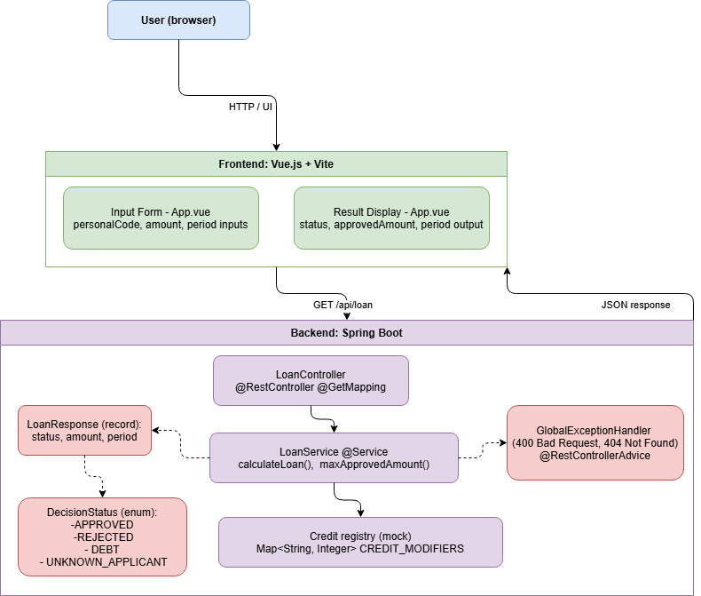

# Banking Decision Engine


A take-home assignment built as part of an internship application. 
The app takes a personal code, loan amount, and period, then decides the best possible loan offer 
-> always the maximum amount the applicant can get, not just whether they qualify.

This was my first real project in Spring Boot and Java beyond university exercises. 
The algorithm looked simple on paper, but getting it right took a few iterations. 
At one point my tests were returning period 20 instead of 60 - my first instinct 
was that the code was wrong, not the test. Turns out I was right: the engine was 
stopping at the first period where the amount passed the minimum threshold, instead 
of continuing to find the actual maximum. Small difference in logic, pretty different 
results.

That's probably the part I learned the most from - writing tests that check the 
intent of the requirement, not just whether the code runs without errors.

---

## Project structure
```
banking-decision-engine/
├── backend/    ← Spring Boot REST API (Java 21)
├── frontend/   ← Vue.js 3 + Vite
└── docs/
    └── architecture.drawio.png
```

---

## Architecture



The frontend sends requests to a single endpoint: `GET /api/loan/check`
The backend handles all the logic and returns a JSON response with a status, approved amount, and period.

---

## How to run

### Backend

Requirements: Java 21, IntelliJ IDEA

1. Open the `backend/` folder in IntelliJ IDEA
2. Maven will download dependencies automatically
3. Run `DemoApplication.java` -> API starts at `http://localhost:8080`

### Frontend

Requirements: Node.js 16+
```bash
cd frontend
npm install
npm run dev
```

Opens at `http://localhost:5173`

---

## How the decision logic works

The scoring formula from the assignment:
```
credit_score = (credit_modifier / loan_amount) * loan_period
```

If the score is below 1, the loan isn't approved. To find the maximum approvable amount the formula rearranges to: `amount = modifier * period`.

The engine always tries to return the **maximum possible amount**, regardless of what the applicant asked for. So if someone applies for 4000 € but could get 6000 €, the response is 6000 €.

The flow on every request:

1. Validate input (amount 2000 - 10 000 €, period 12 – 60 months)
2. Check for existing debt -> reject immediately if found
3. Calculate max approvable amount for the requested period -> return it if ≥ 2000 €
4. If the requested period doesn't work, search all periods (12 – 60) and return the one with the highest possible amount
5. If nothing works, return a rejection

### Test personal codes

| Personal code  | Result                 | Credit modifier |
|----------------|------------------------|-----------------|
| `49002010965`  | Debt -> always rejected|        -        |
| `49002010976`  | Segment 1              | 100             |
| `49002010987`  | Segment 2              | 300             |
| `49002010998`  | Segment 3              | 1000            |

---

## Tech choices

### Spring Boot

Chosen because it's standard in the industry and came recommended for this kind of backend. It handles a lot of the boilerplate - embedded Tomcat, JSON serialization, error responses, so I could focus on the business logic.

### Vue.js 3 + Vite

I picked Vue because I had some prior experience with it. Vite made setup fast and `v-model` made the sliders and inputs easy to wire up reactively.

### Why `Map` and not `List` for storing credit modifiers
```java
private static final Map<String, Integer> CREDIT_MODIFIERS = Map.of(
    "49002010976", 100,
    "49002010987", 300,
    "49002010998", 1000
);
```

A `List` would mean looping through every entry to find the right personal code.
A `Map` goes straight to it by key - no loop needed. It also reads more clearly
as a lookup table, which is exactly what it is.

### Why `DecisionStatus` enum and not a boolean
```java
public enum DecisionStatus {
    APPROVED,
    REJECTED,
    DEBT,
    UNKNOWN_APPLICANT
}
```

A boolean `true/false` only tells you whether the loan was approved or not. It doesn't tell you why it was rejected and the frontend needs to know that to show the right message to the user.

With a boolean, `false` could mean debt, unknown personal code, or just no valid amount found. With an enum, each case is explicit and the frontend can handle them differently.
---

## Tests

JUnit 5 unit tests for `LoanService`. This was my first time writing tests in Java. I ran into a bug while writing them: my initial implementation was returning the first period where the amount met the minimum (2000 €), not the maximum possible amount. The tests caught it.

For example, segment 1 (modifier 100) with a requested period of 12 months:
- Period 12 → `100 * 12 = 1200` — below minimum, doesn't work
- Period 20 → `100 * 20 = 2000` — meets minimum, but this isn't the max
- Period 60 → `100 * 60 = 6000` — this is the actual maximum, which is what the assignment asks for

After fixing the logic, the tests pass:
```java
@Test
void shouldApproveSegment3WithMaxLimit() {
    // modifier 1000 * 12 = 12000, capped at 10000
    LoanResponse response = loanService.calculateLoan("49002010998", 4000, 12);
    assertEquals(DecisionStatus.APPROVED, response.status());
    assertEquals(10000, response.approvedAmount());
    assertEquals(12, response.period());
}

@Test
void shouldRejectIfDebtExists() {
    LoanResponse response = loanService.calculateLoan("49002010965", 4000, 12);
    assertEquals(DecisionStatus.DEBT, response.status());
}

@Test
void shouldThrowExceptionForInvalidAmount() {
    assertThrows(InvalidInputException.class, () ->
        loanService.calculateLoan("49002010976", 500, 12)
    );
}

@Test
void shouldFindAlternativePeriod() {
    // modifier 100, best possible: 100 * 60 = 6000 at period 60
    LoanResponse response = loanService.calculateLoan("49002010976", 4000, 12);
    assertEquals(DecisionStatus.APPROVED, response.status());
    assertEquals(60, response.period());
    assertEquals(6000, response.approvedAmount());
}
```
```bash
cd backend
./mvnw test
```

---

## What I'd improve

The scoring formula works, but it felt a bit disconnected from how loans actually 
work. There's no interest rate anywhere, the engine decides how much to approve, 
but the period has no real cost attached to it. This means longer periods are always 
better in the formula, which isn't realistic at all.

I'd add an interest rate to the mix, even a simple fixed one. That way a longer 
period would increase the total repayment amount, and the engine would have to 
balance between approving a higher sum and keeping the overall cost reasonable. 
It wouldn't make the implementation much harder, but it would make the whole thing 
feel closer to an actual lending decision.
